<h3><code>dharshan@github ~ $ ./contributions.sh</code></h3>

  

<h3><code>dharshan@github ~ $ whoami</code></h3>

<table>
<tr>

<td valign="top">

</td>

<td valign="top">

</td>

</tr>
</table>

 

<h3><code>dharshan@github ~ $ ls projects</code></h3>

<code>AI • Full Stack • Automation • SaaS</code>

  

